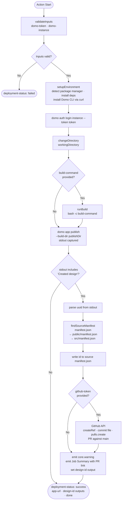

# Action Pipeline

```mermaid
flowchart TD
    START([Action Start]) --> VALIDATE["validateInputs<br/>domo-token · domo-instance"]
    VALIDATE --> VALID{"Inputs valid?"}
    VALID -- No --> FAIL(["deployment-status: failed"])
    VALID -- Yes --> SETUP["setupEnvironment<br/>detect package manager · install deps<br/>install Domo CLI via curl"]
    SETUP --> AUTH["domo auth login instance --token token"]
    AUTH --> CHDIR["changeDirectory<br/>workingDirectory"]
    CHDIR --> HASBUILD{"build-command<br/>provided?"}
    HASBUILD -- Yes --> BUILD["runBuild<br/>bash -c build-command"]
    HASBUILD -- No --> PUBLISH
    BUILD --> PUBLISH["domo app publish<br/>--build-dir publishDir<br/>stdout captured"]
    PUBLISH --> NEWDESIGN{"stdout includes<br/>'Created design'?"}
    NEWDESIGN -- No --> SUCCESS
    NEWDESIGN -- Yes --> PARSEID["parse uuid from stdout"]
    PARSEID --> FINDMANIFEST["findSourceManifest<br/>manifest.json<br/>→ public/manifest.json<br/>→ src/manifest.json"]
    FINDMANIFEST --> WRITEMANIFEST["write id to source manifest.json"]
    WRITEMANIFEST --> HASTOKEN{"github-token<br/>provided?"}
    HASTOKEN -- Yes --> OPENPR["GitHub API<br/>createRef · commit file · pulls.create<br/>PR against main"]
    HASTOKEN -- No --> NOTIFY
    OPENPR --> NOTIFY["emit core.warning<br/>emit Job Summary with PR link<br/>set design-id output"]
    NOTIFY --> SUCCESS
    SUCCESS(["deployment-status: success<br/>app-url · design-id outputs · done"])
```
