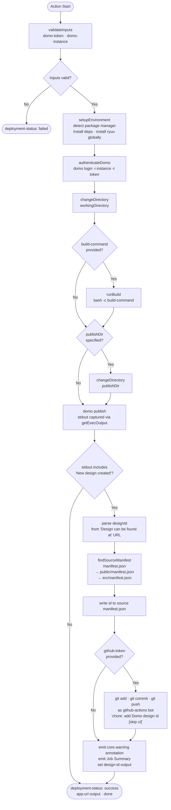

# Action Pipeline

```mermaid
flowchart TD
    START([Action Start]) --> VALIDATE["validateInputs<br/>domo-token · domo-instance"]
    VALIDATE --> VALID{"Inputs valid?"}
    VALID -- No --> FAIL(["deployment-status: failed"])
    VALID -- Yes --> SETUP["setupEnvironment<br/>detect package manager<br/>install deps · install ryuu globally"]
    SETUP --> AUTH["authenticateDomo<br/>domo login -i instance -t token"]
    AUTH --> CHDIR1["changeDirectory<br/>workingDirectory"]
    CHDIR1 --> HASBUILD{"build-command<br/>provided?"}
    HASBUILD -- Yes --> BUILD["runBuild<br/>bash -c build-command"]
    HASBUILD -- No --> PUBDIRCHECK
    BUILD --> PUBDIRCHECK{"publishDir<br/>specified?"}
    PUBDIRCHECK -- Yes --> CHDIR2["changeDirectory<br/>publishDir"]
    PUBDIRCHECK -- No --> PUBLISH
    CHDIR2 --> PUBLISH["domo publish<br/>stdout captured via getExecOutput"]
    PUBLISH --> NEWDESIGN{"stdout includes<br/>'New design created'?"}
    NEWDESIGN -- No --> SUCCESS
    NEWDESIGN -- Yes --> PARSEID["parse designId<br/>from 'Design can be found at' URL"]
    PARSEID --> FINDMANIFEST["findSourceManifest<br/>manifest.json<br/>→ public/manifest.json<br/>→ src/manifest.json"]
    FINDMANIFEST --> WRITEMANIFEST["write id to source manifest.json"]
    WRITEMANIFEST --> HASTOKEN{"github-token<br/>provided?"}
    HASTOKEN -- Yes --> GITCOMMIT["git add · git commit · git push<br/>as github-actions bot<br/>'chore: add Domo design id [skip ci]'"]
    HASTOKEN -- No --> NOTIFY
    GITCOMMIT --> NOTIFY["emit core.warning annotation<br/>emit Job Summary<br/>set design-id output"]
    NOTIFY --> SUCCESS
    SUCCESS(["deployment-status: success<br/>app-url output · done"])
```
