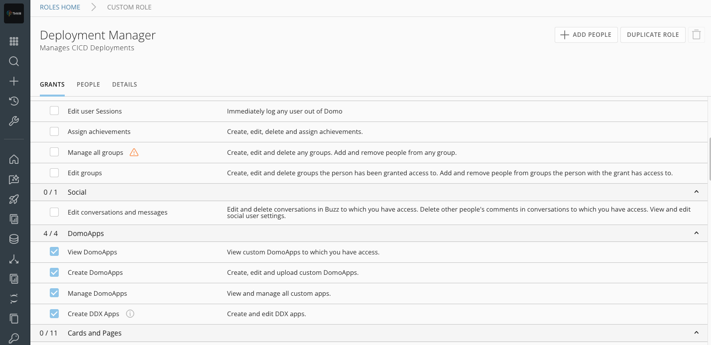
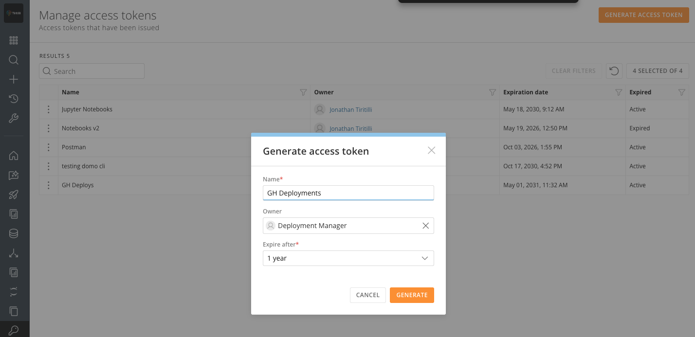

# CICD Service Account Setup

---

## Step 1 — Create the service account in Domo

1. **Admin → Governance → People → Invite People**
2. Use a shared email (e.g. `cicd@yourcompany.com`)
3. Assign a role with: **View DomoApps**, **Create DomoApps**, **Manage DomoApps**
4. Sign in once to activate the account



> SSO orgs: provision the account through your identity provider first.

---

## Step 2 — Generate a developer token

1. Sign in as the CICD account
2. **Admin → Security → Access Tokens → Generate Access Token**
3. Name it `github-actions-publish`, set an expiry, copy it immediately



---

## Step 3 — Add to GitHub

**Settings → Secrets and variables → Actions:**

| Name | Value | Type |
|---|---|---|
| `DOMO_TOKEN` | Developer token from Step 2 | Secret |
| `DOMO_INSTANCE` | e.g. `domo-yourcompany.domo.com` | Variable |

**Settings → Actions → General → Workflow permissions:**
Check **"Allow GitHub Actions to create and approve pull requests"**

---

## Step 4 — Add the workflow

### ProCode / flat app (no build step)

```yaml
# .github/workflows/deploy.yml
name: Deploy to Domo
on:
  push:
    branches: [main]
  workflow_dispatch:

permissions:
  contents: write
  pull-requests: write

env:
  FORCE_JAVASCRIPT_ACTIONS_TO_NODE24: "true"

jobs:
  deploy:
    runs-on: ubuntu-latest
    steps:
      - uses: actions/checkout@v4
      - uses: DomoApps/domoapps-publish-action@v3
        with:
          domo-token: ${{ secrets.DOMO_TOKEN }}
          domo-instance: ${{ vars.DOMO_INSTANCE }}
          github-token: ${{ secrets.GITHUB_TOKEN }}
```

### React / Vite app with pnpm

```yaml
# .github/workflows/deploy.yml
name: Deploy to Domo
on:
  push:
    branches: [main]
  workflow_dispatch:

permissions:
  contents: write
  pull-requests: write

env:
  FORCE_JAVASCRIPT_ACTIONS_TO_NODE24: "true"

jobs:
  deploy:
    runs-on: ubuntu-latest
    steps:
      - uses: actions/checkout@v4
      - uses: pnpm/action-setup@v4
        with:
          version: 10
      - uses: actions/setup-node@v4
        with:
          node-version: 24
          cache: pnpm
      - uses: DomoApps/domoapps-publish-action@v3
        with:
          domo-token: ${{ secrets.DOMO_TOKEN }}
          domo-instance: ${{ vars.DOMO_INSTANCE }}
          github-token: ${{ secrets.GITHUB_TOKEN }}
          build-command: pnpm run build:ci
          publish-dir: ./build
```

> `build:ci` must **not** trigger a `prebuild` lifecycle hook — use a script name other than `build` to avoid `da apply-manifest` running without a TTY. See the `@domoinc/da` section in the README.

---

## First deploy

On first push, `manifest.json` has no `id`. The action will:

1. Publish — Domo creates a new design and returns its id
2. Write the `id` to your source `manifest.json`
3. Open a PR `chore/domo-design-id-{8chars}` against `main`
4. **Merge the PR** — all future deployments update the same design
