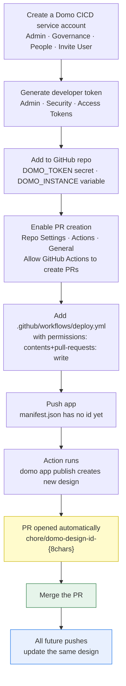

# First-Time Setup Flow

```mermaid
flowchart TD
    ACCOUNT["Create a Domo CICD service account<br/>Admin · Governance · People · Invite User"]
    ACCOUNT --> TOKEN["Generate developer token<br/>Admin · Security · Access Tokens"]
    TOKEN --> SECRETS["Add to GitHub repo<br/>DOMO_TOKEN secret · DOMO_INSTANCE variable"]
    SECRETS --> SETTINGS["Enable PR creation<br/>Repo Settings · Actions · General<br/>Allow GitHub Actions to create PRs"]
    SETTINGS --> WORKFLOW["Add .github/workflows/deploy.yml<br/>with permissions: contents+pull-requests: write"]
    WORKFLOW --> PUSH["Push app<br/>manifest.json has no id yet"]
    PUSH --> ACTION["Action runs<br/>domo app publish creates new design"]
    ACTION --> PR["PR opened automatically<br/>chore/domo-design-id-{8chars}"]
    PR --> MERGE["Merge the PR"]
    MERGE --> DONE["All future pushes<br/>update the same design"]

    style PR fill:#fffbcc,stroke:#ccb700
    style MERGE fill:#e6f4ea,stroke:#2d7d46
    style DONE fill:#e8f0fe,stroke:#1a73e8
```
