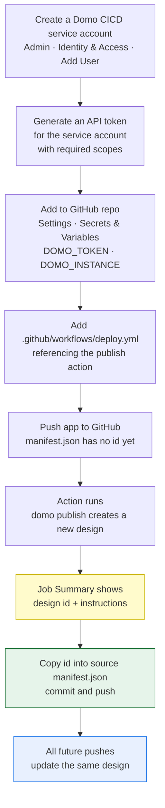

# First-Time Setup Flow

```mermaid
flowchart TD
    ACCOUNT["Create a Domo CICD service account<br/>Admin · Identity &amp; Access · Add User"]
    ACCOUNT --> TOKEN["Generate an API token<br/>for the service account<br/>with required scopes"]
    TOKEN --> SECRETS["Add to GitHub repo<br/>Settings · Secrets &amp; Variables<br/>DOMO_TOKEN · DOMO_INSTANCE"]
    SECRETS --> WORKFLOW["Add .github/workflows/deploy.yml<br/>referencing the publish action"]
    WORKFLOW --> PUSH["Push app to GitHub<br/>manifest.json has no id yet"]
    PUSH --> ACTION["Action runs<br/>domo publish creates a new design"]
    ACTION --> SUMMARY["Job Summary shows<br/>design id + instructions"]
    SUMMARY --> MANUAL["Copy id into source manifest.json<br/>commit and push"]
    MANUAL --> DONE["All future pushes<br/>update the same design"]

    style SUMMARY fill:#fffbcc,stroke:#ccb700
    style MANUAL fill:#e6f4ea,stroke:#2d7d46
    style DONE fill:#e8f0fe,stroke:#1a73e8
```
